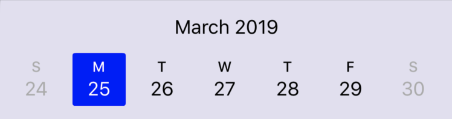
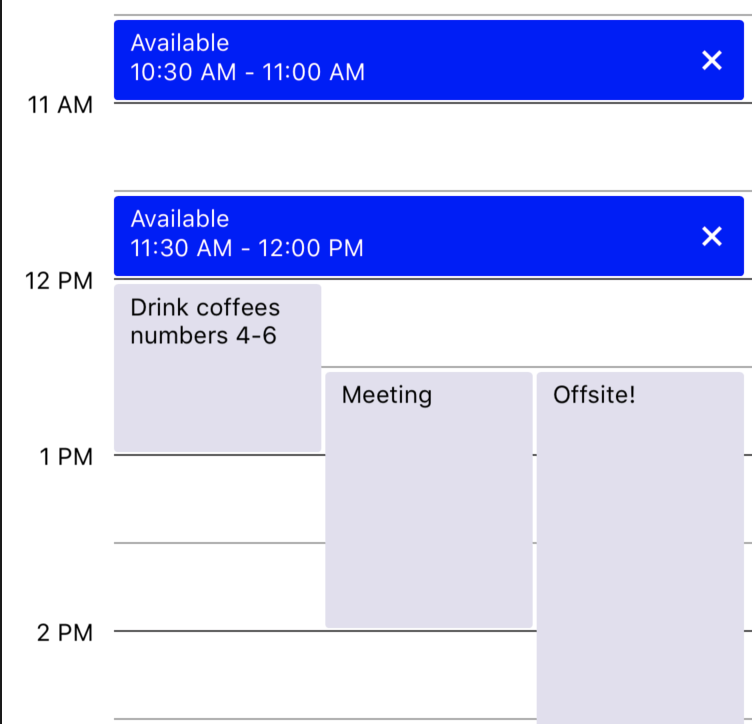

# Tachyon
---
Tachyon provides configurable UI components commonly used in calendar features and applications.

[Click here for the Android version.](https://github.com/linkedin/Tachyon)

# Why use Tachyon
---
Tachyon is a library written in Objective-C but fully compatible with Swift 4. While there are a few libraries out there that have similar features, what sets Tachyon apart are the following:
- Granular customization of color and fonts of all main components
- Handling different time zones with different weekends
- Full support of internationalization (including RTL languages)

We are also actively working on this library, which means more features and customization (including support for VoiceOver accessibility) will be coming in the near future!

# Overview
---
Tachyon consists of two primary components:

### TCNDatePicker
This is a pannable view that allows users to select dates of the year. It supports all locale formats, including right-to-left layout.



### TCNDayView
This is the calendar view of a single day, which can display events or time slots. The event data is held in `TCNEvent`, which closely mirrors Apple's `EKEvent` in EventKit. Users can view events, scroll, and tap to create or dismiss events.



# Getting Started
---
### Installation
Add the following line to your Podfile:
```Ruby
pod 'Tachyon', :git => 'https://github.com/linkedin/Tachyon-iOS.git'
```

Then, run `pod install`.

You may also clone or download this repository and drag the Tachyon folder into your iOS project.

### Integrating with your project
Import the library:
```swift
import Tachyon
```

### Importing UI components

```swift
override func viewDidLoad() {
  super.viewDidLoad()

  let datePickerConfig = TCNDatePickerConfig()
  let datePicker = TCNDatePickerView(frame: CGRect.zero, config: datePickerConfig)
  datePicker.datePickerDelegate = self

  view.addSubview(datePicker)

  let dayViewConfig = TCNDayViewConfig()
  let dayView = TCNDayView(frame: CGRect.zero, config: dayViewConfig)
  dayView.dataSource = self
  dayView.delegate = self

  view.addSubview(dayView)
}
```

# Sample application
Build and run the `TachyonSampleApp` target. This is a simple implementation of the library that allows users to select different dates and create half-hour long events on them.

# Testing
The project includes a unit test and UI test target, providing coverage of the basic layout and functionality of the product. When adding a new feature, be sure to add unit tests and a basic layout test if applicable.

Test targets are configured to run in English, with a United States locale. This is to enforce consistency in application behavior during testing. If you wish to test for a specific locale, please inject that locale *specifically* for your test, and do not change any schemes to dynamic locale. This will break tests in certain regions.
